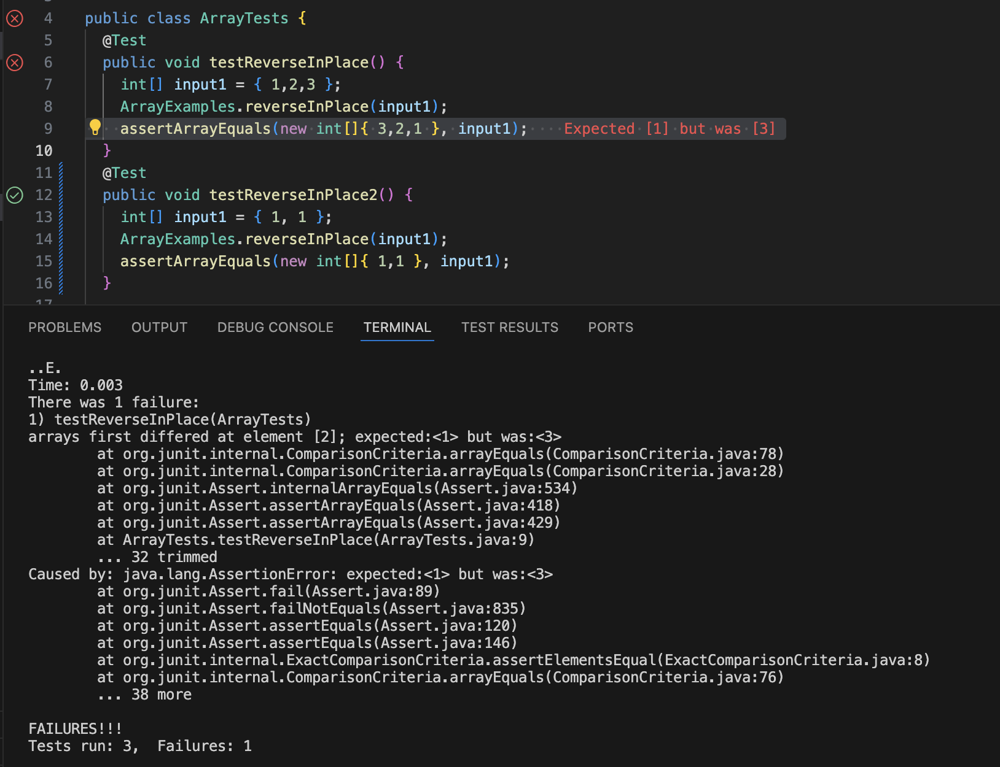

Buggy Program:

```
static void reverseInPlace(int[] arr) {
  for(int i = 0; i < arr.length; i += 1) {
    arr[i] = arr[arr.length - i - 1];
  }
}
```

1: A failure-inducing input for the buggy program, as a JUnit test and any associated code:
```
@Test 
public void testReverseInPlace() {
  int[] input1 = { 1,2,3 };
  ArrayExamples.reverseInPlace(input1);
  assertArrayEquals(new int[]{ 3,2,1 }, input1);
}
```
2: An input that doesn't induce a failure:
```	
@Test 
public void testReverseInPlace2() {
  int[] input1 = { 1, 1 };
  ArrayExamples.reverseInPlace(input1);
  assertArrayEquals(new int[]{ 1,1 }, input1);
}
```


3: The symptom is that the test fail because it incorrectly reversed array that didn’t match the expected array.



The output is `arrays first differed at element [2]; expected:<1> but was:<3>.`

4: The bug: reverseInPlace method doesn't correctly complete the swap:
```
static void reverseInPlace(int[] arr) {
  for(int i = 0; i < arr.length; i += 1) {
    arr[i] = arr[arr.length - i - 1];
  }
}
```
Fixed program:
```
static void reverseInPlace(int[] arr) {
  int num = 0;
  for(int i = 0; i < arr.length/2; i += 1) {
    num = arr[i];
    arr[i] = arr[arr.length - i - 1];
    arr[arr.length - i - 1] = num;
  }
}
```
This program can fix the bugs, because I change the loop’s exit condition to arr.length/2. So, the swap between first half and second half of array can correctly execute.

# Part 2

## grep -r: (recursive)
`grep -r ".txt" ./technical/`
```
./technical//biomed/gb-2003-4-5-r34.txt:            20,000), and repeat the process. The Readme.txt file
./technical//biomed/gb-2001-2-7-research0025.txt:        Pfam_Annotation.txt
./technical//biomed/gb-2001-2-7-research0025.txt:        Protein_Annotation.txt
./technical//biomed/gb-2002-3-7-research0037.txt:        README.txt contains instructions for installation and
./technical//biomed/gb-2002-3-6-software0001.txt:        as .txt files (tab-delimited text, refer to the user's
./technical//biomed/gb-2002-3-12-research0078.txt:          .txt extension.
./technical//biomed/gb-2001-2-9-research0037.txt:          hyb2dis.txt in additional data files). More importantly,
./technical//biomed/gb-2001-2-9-research0037.txt:        hyb2dis.txt: patch file that converts White's hybridize
./technical//biomed/gb-2001-2-9-research0037.txt:        Training sets(GlycineMedicago.txt,Rhizobia.txt,
...
```
`grep -r "911" ./technical/911report/`
```
./technical/911report//chapter-13.5.txt:                received by civilians in the towers based on (1) calls to NYPD 911 from or
./technical/911report//chapter-13.5.txt:                September 11, 2001 (hereafter "Commission analysis of 911/PAPD calls"). Everyone
./technical/911report//chapter-13.5.txt:                Commission analysis of 911/PAPD calls; Civilian interview 17 (May 11, 2004);
./technical/911report//chapter-13.5.txt:                analysis of 911/PAPD calls; Port Authority transcripts of recorded Port Authority
./technical/911report//chapter-13.5.txt:            32. Commission analysis of 911/PAPD calls.
./technical/911report//chapter-13.5.txt:                2004); Civilian interview 14 (Apr. 7, 2004); Commission analysis of 911/PAPD calls.
./technical/911report//chapter-13.5.txt:                7 (Mar. 22, 2004); Commission analysis of 911/PAPD calls. For some emergency
./technical/911report//chapter-13.5.txt:            36. For callers being disconnected, see Commission analysis of 911/PAPD calls. For
./technical/911report//chapter-13.5.txt:                and terminations, see Commission analysis of 911/PAPD calls.
```
-r command searches recursively for the word in files within the directory. Useful when searching through complex file hierarchies.

## grep -v:(invert-match)
`grep -v ".txt" find-results.txt`
```
technical/plos
```
`grep -v "journal" find-results.txt`
```
technical/plos
technical/plos/pmed.0020273.txt
technical/plos/pmed.0020065.txt
technical/plos/pmed.0020071.txt
technical/plos/pmed.0020059.txt
technical/plos/pmed.0010039.txt
technical/plos/pmed.0010010.txt
technical/plos/pmed.0020104.txt
...
```
It return all lines from the file that do not contain the word. Very useful when a word I don't need shows up too many times.

## grep -n:(line-number)

`grep -n ".txt" find-results.txt`
```
2:technical/plos/pmed.0020273.txt
3:technical/plos/journal.pbio.0030032.txt
4:technical/plos/pmed.0020065.txt
5:technical/plos/pmed.0020071.txt
...
252:technical/plos/pmed.0020281.txt
253:technical/plos/pmed.0020242.txt
```
`grep -n "0010013" find-results.txt`
```
21:technical/plos/pmed.0010013.txt
```
It returns the line numbers where the specific word is found. Useful when I don't know where to find a specific file or word.

## grep -C:(Context Control)
`grep -C 2 "technical/plos/pmed.0010013.txt" find-results.txt`
```
technical/plos/journal.pbio.0020431.txt
technical/plos/journal.pbio.0020419.txt
technical/plos/pmed.0010013.txt
technical/plos/pmed.0020113.txt
technical/plos/journal.pbio.0020169.txt
```
It returns 2 lines of context around the match file.

`grep -A 2 "technical/plos/pmed.0010013.txt" find-results.txt`
```
technical/plos/pmed.0010013.txt
technical/plos/pmed.0020113.txt
technical/plos/journal.pbio.0020169.txt
```
It returns2 lines of context after the match file. Useful when I want to know context.


# Cite source:
ChatGPT

Prompt: `give me 4 interesting command-line options of command grep`

Output: 
```
The grep command is incredibly versatile and powerful for searching text in files using patterns. Here are four interesting command-line options for grep that can enhance its functionality:

Recursive Search (-r or --recursive):
This option allows grep to perform a recursive search through directories, meaning it will search through all files in the specified directory and all of its subdirectories. This is particularly useful for searching through complex file hierarchies, like those of a project.Example:
bash
Copy code
grep -r "search_pattern" /path/to/directory
Invert Match (-v or --invert-match):
This option tells grep to return only the lines that do not match the given pattern. It's useful when you want to filter out lines and see only those that do not contain the specified text.Example:
bash
Copy code
grep -v "unwanted_pattern" filename
Line Number (-n or --line-number):
This option causes grep to output the line number in front of each matching line. This is helpful when you need to know the location of the text in a file, not just the content of the matching lines.Example:
bash
Copy code
grep -n "pattern" filename
Context Control (-C, -B, -A):
These options control the number of lines of context to be displayed around each matching line. -C (or --context) shows the specified number of lines before and after the match, -B (or --before-context) shows only the lines before the match, and -A (or --after-context) shows only the lines after the match.Example:
bash
Copy code
grep -C 2 "pattern" filename  # Shows 2 lines of context around each match
Each of these options can greatly influence how you interact with and analyze text data on the command line.
```
